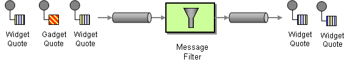

class: center, middle

# Integration patterns with messaging.

[live presentation](https://alonisser.github.io/integration-patterns-messaging) <br/>
[twitter](alonisser@twitter.com), [medium](https://medium.com/@alonisser/)

#####Shameless promotion: you can also read my political blog: [דגל אדום](degeladom@wordpress.com)
---

# The dream of One Integrated system

Once men dreamt of one integrated system, answering all possible needs.

--

Of course we know how that ends

--

"One Ring to rule them all, One Ring to find them,
 One Ring to bring them all and in the darkness bind them"

.img-half-container[]

---

# Integration

* Applications rarely live in isolation

* business functionality is spread between cutting edge microservices, ageing monoliths  and the Ancient Dinosaurs in the basement.

--

* Various third parties services provide different business functions like accounting, HR, sales management, billing, tracking, customer relations, etc(hooray for SAAS).
Constant build/buy decisions make this more complicated by the day 

--

Users/Stakeholders of course want to access and change the data without ever knowing any of this complexity. 

---

# Integration challenges

* Networks are unreliable (And slow)

--

* Consistency is hard

--

* Applications are not trustworthy. You can never know if the other side would be available when you need it.


-- 

* No two applications are the same, different technology, different business domain.

--

* Change is inevitable: Technology changes, Business requirements change, Environments change, User expectations change

---

# Integration challenges

* Integrators have limited organizational authority over various enterprise apps. (We won't adapt our app to your needs) Might also be a third party we buy something from.

* Even with authority, Integrators have limited resources to change existing applications (Might not be even possible with "over the shelf" software products)


---
class: center, middle
# Integration patterns

Common approaches to integrating different applications

---

# Integration pattern: File transfer

One application writes a file periodically (or by request) to a place where another application can consume
--
Pros:
* Suitable perhaps when moving lots of "tabular" data

* Can be Easier to implement 

--
Cons:

* Locking

* "Heavy updates" => longer "out of sync" periods.

* knowing when something has been updated and the files needs to be consumers.

* When multiple apps needs the data, who handles fetching, syncing state, etc

* Ensuring no missed data (If a consumer was down)

---

# Integration pattern: Shared Db
Two apps share a db as way to share data, perhaps one only reads and one reads and writes ("the owner") 
--
Pros:
* Fast and consistent updates

--

Cons:
* Deep coupling between different apps

* Who "owns" the scheme? what happens when one app changes the scheme and breaks the other. Especially when you don't control the schema by a prepackaged third party.

* Does not scale way with geographically remote apps (Would probably need to setup expensive and fragile replication and lose lots of the benefits) 

---

# Integration pattern: Invoking a remote blocking Api (Remote procedure invocation)
Invoking a remote api directly in synchronous way 

--
Pros:
* Easier to implement

* Easier transaction handling

--
Cons:
* Remote procedures are disguised as local procedures and hiding the big differences between the cases (See the fail of lots of desktop accounting apps migrated to "cloud server")

* Demand synchronous existence of both parties. Both need to be up and working during the period of the transaction

* Coupled

* One app needs to know a lot obout the other collaborators (or have an orchestrator knowing all that) 
 
---
# Messaging

First, A Question: who prefers a phone call over email/whatsapp?

--

Phonecall vs Email demonstarate the core difference between http api and a messaging api: sync vs async conversions. 


---

# Messaging

* (quite) reliable, (Optionally) persistent, (Usually) ordered, directional channels, decoupled from applications. Delivering messages with data and metadata.

* Messaging capabilities are typically provided by a s separate software system.
 
* A messaging system "moves" messages from a sender to a receiver over the unreliable network 

* Common Message Systems implementations: Rabbitmq, AWS SQS, Google pub/sub

---

# Integration pattern: Messaging

Pros:
* Async sending a message does not require both systems to be up and ready at the same time. Also variable timing for producing/consuming

* Throttling, Scaling

* Reliability, Order.

* When using common messaging systems we abstract technical communication code out of our app, and gain polyglot language support. 

* Furthermore, thinking about the communication in an asynchronous manner forces developers to recognize that working with a remote application is slower, which encourages design of components with high cohesion (lots of work locally) and low adhesion (selective work remotely).
from *Enterprise integration patterns*

---

# Integration pattern: Messaging

Cons:
* Complex (At least perceived as), harder to reason about. 

* Sequence handling

* Handling Synchronous scenarios

* Vendor lock in (Less so today)
---


# Messaging Integration architecture: Pipes and filters

We all know and use pipes and filter architecture through the unix toolset: A number of tools, each doing **ONE THING** well, inteconnected by stream, without expections about other tools in the chain.
 Perform a processing task

```bash
cat long.txt | grep "interesting data" | sort | tail -n 10 
# Get only lines containing interesting from a long log file, sort by date and show the last (most updated) ten lines 
```

---

# Messaging Integration architecture: Pipes and filters

* Use the Pipes and Filters architectural style to divide a larger processing task into a sequence of smaller, independent processing steps (Filters) that are connected by channels (Pipes).
.img-container[]

---

# Messaging Integration architecture: Pipes and filters

* Messaging is well suited to this kind of architecture, since directional and ordered streams of data is builtin in messaging.

* "Each filter exposes a very simple interface: it receives messages on the inbound pipe, processes the message, and publishes the results to the outbound pipe.
 The pipe connects one filter to the next, sending output messages from one filter to the next. Because all component use the same external interface they can be composed into different solutions by connecting the components to different pipes. 
 
* We can add new filters, omit existing ones or rearrange them into a new sequence - all without having to change the filters themselves. 
 
--
 
* Filters can be anything that process a message! Common uses are:
 transforming a message (like normalizing as part of an ETL pipeline), encoding/decoding, adds metadata to messages.  Discards of certain messages, or of confidential data. Routes messages to different channels, etc
  
---

# Message type: Command

* A message containing a command "updateRegistrationDetails", "sendEmail"

* Sort of remote rpc with the benefits of messaging.

* Can be part of a "request-response" messaging pattern, where the sender awaits a response with the result of the command  

---

# Message type: Document

* A message containing data ("A document"): An application monitor publishing monitor result every minute for example.

* Can be in response to a command event Or just a synchronisation method updating current state.

---


# Message type: Event

* The message tells receivers that something happened, optionaly carrying data about the event: "PriceUpdatedEvent" or "ItemAddedEvent" can just notify a price has been update or deliver the full new catalog, or anything in between.

* Can contain a document if a "fat" event

* This kind of architecture is more decoupled. And we can call it "Event driven"

---
# Integration problem: Connecting different messaging systems

* We need to alert our app on an update in AWS DynamoDB. Our app is connected to RabbitMQ messaging system while DynamoDB emits SQS events

---

# Messaging Integration pattern: bridge

Connects different messaging systems:

* A lambda function that receives AWS SNS events and publishes on our inner messaging system (Perhaps rabbitmq)

* A websockets adapter, connecting Inner messaging bus (Using rabbitmq) to browsers utilizing web sockets for "realtime" communication and updates. 

---

# Messaging Integration pattern: router
consumes a Message from one Message Channel and republishes it to a different Message Channel channel depending on a set of condition

* Routing can be based on content, message headers and topics, or on a connected db with configurable rules

* Router can also be stateful (route this message according to how I routed the previous one)
 
---

# Messaging Integration pattern: router

.img-container[]

---
# Integration problem: Filtering

* Apps are overwhelmed by messages they don't actually need

---

# Messaging Integration pattern: filter
A specific use case of Message Router, a Message Filter, to eliminate undesired messages from a channel based on a set of criteria.

* On a trade platform, filter out old quotes, that were not processed in time. 
* A filter might be stateful (remove messages if already encountered the message Id) 
* A filter configuration might be dynamic: for example a filter that filters logging messages according to the required log level
* A filter might implement business logic Like filtering out prices changes that won't justify customers alert.

--

* Note That filtering a message in a specific channel, does not mean other apps should not consume the message, Price change would be interesting to accounting, even a very small one.

---

# Messaging Integration pattern: filter

A filter can be implemented directly in the messaging system,. like RabbitmMQ binding in direct and topic exchanges, or Headers in Header exchange, etc
The more logic It needs, less probable it can be implemented without a specific component.

.img-container[]

---

# Integration problem: Connecting non message aware apps

* A common scenario is needing to update/get data from a non message aware app which isn't in our control (or without development capacity to add messaging)

---

# Messaging Integration pattern: Channel Adapter	

Connects "non messaging apps" to messaging:
Either for allowing non messaging collaborators to publish changes to be consumed by other apps/services. 

--

* mandrill/mailgun/etc provide webhooks functionality, a Cloud function connected to Api gateway, can receive this hook and send a message with the data.

* MSSQL can trigger a "hook" on CRUD which can be used to send a message through the adapter with the data

--

Or to invoke a non messaging app functionality:

* A voucher system publishes an event on new vouchers and a an adapter can listen to this event and write it to Priority accounting system "upload tables" 

---

# Messaging Integration pattern: Scatter/gather
broadcasts a message to multiple recipients and re-aggregates the responses back into a single message
* Send a command message to different microservices to setup a user, lock the user in request until we got a reply from all services and only then allow him to login

---

# Messaging integration patterns

Other Interesting patterns
* splitter (Example: Splitting an event with many push recipients to a message per recipient to allow different logic)  
* Aggregator (other way around)

--

* Content Enricher (Adding data/metadata)

--

* Message store (Saving messages for future replaying the messages/ debugging / etc)

-- 

* Message translator (translate formats)

# Read some more

* [Enterprise Integration patterns](http://www.enterpriseintegrationpatterns.com/) A site dedicated to the book, with more discussions, modern code examples

---

class: center, middle

#Open source rocks!

---

class: center, middle

#Thanks for listening!

---
